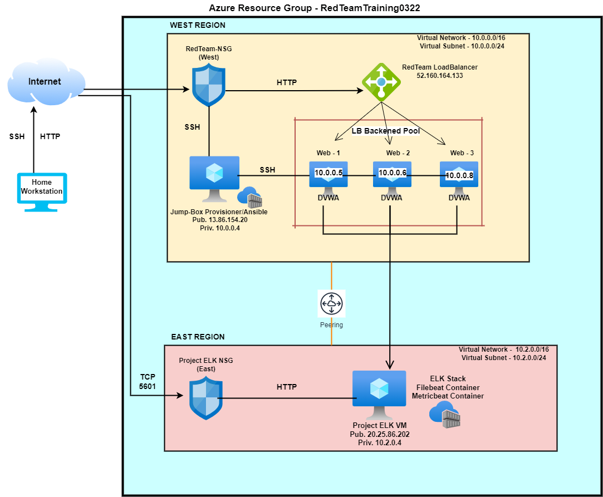

# IT-Projects
# Automated ELK Stack Deployment

The files in this repository were used to configure the network depicted below.

These files have been tested and used to generate a live ELK deployment on Azure. They can be used to either recreate the entire deployment pictured above. Alternatively, select portions of the YAML file may be used to install only certain pieces of it, such as Filebeat.

  - [Filebeat-Playbook.yml](https://github.com/Ilhan83/IT-Projects/blob/main/Ansible/Filebeat-playbook.yml)
  - [Install-ELK.yml](https://github.com/Ilhan83/IT-Projects/blob/main/Ansible/Install-Elk.yml)
  - [Metricbeat-Playbook.yml](https://github.com/Ilhan83/IT-Projects/blob/main/Ansible/Metricbeat-Playbook.yml)

This document contains the following details:
- Description of the Topology
- Access Policies
- ELK Configuration
  - Beats in Use
  - Machines Being Monitored
- How to Use the Ansible Build

### Description of the Topology

The main purpose of this network is to expose a load-balanced and monitored instance of DVWA, the D*mn Vulnerable Web Application.

Load balancing ensures that the application will be highly available, in addition to restricting access to the network.
- What aspect of security do load balancers protect? 
 
 A Load Balancer mitigates DDOS attacks as well as distributes connection to multiple servers. According to Azure Security Benchmark, Load Balancers only allow traffic to backend resources from within certain virtual networks or peered virtual networks without exposure to the internet.
 
 - What is the advantage of a jump box?
 
 The Jump Box is the only Virtual Machine exposed to the public internet, whereas the other VM's are not, thus controlling access to other machines by allowing connections from specific IP addresses and forwarding to those machines.

Integrating an ELK server allows users to easily monitor the vulnerable VMs for changes to the data logs and system metrics.
- What does Filebeat watch for?

Filebeat collects data about the file system, in other words it monitors the log files or loactions that you specify, collects log events and forwards them either to Elasticsearch or Logstash for indexing.
- What does Metricbeat record?

Metricbeats collects machines metrics from the system and services that are running on the server) such as uptime.

The configuration details of each machine may be found below.
_Note: Use the [Markdown Table Generator](http://www.tablesgenerator.com/markdown_tables) to add/remove values from the table_.

| Name     | Function | IP Address | Operating System |
|----------|----------|------------|------------------|
| Jump Box | Gateway  |13.86.154.20; 10.0.0.4| Linux  |
| Web 1    | Webserver|10.0.0.5      |         Linux   |
| Web 2     |Webserver|  10.0.0.6  |            Linux  |
| Web 3    |Webserver|10.0.0.8|Linux|
| ELK      |Kibana    | 20.25.86.202; 10.2.0.4 |Linux|

### Access Policies

The machines on the internal network are not exposed to the public Internet. 

Only the Jump Box Provisioner machine can accept connections from the Internet. Access to this machine is only allowed from the following IP addresses:
 73.247.212.56, which is my personal home network.

Machines within the network can only be accessed by Jump Box via SSH.
- Which machine did you allow to access your ELK VM? What was its IP address?

My ELK VM can be access by my Jump Box VM via Private IP 10.0.0.4

A summary of the access policies in place can be found in the table below.

| Name     | Publicly Accessible | Allowed IP Addresses |
|----------|---------------------|----------------------|
| Jump Box | Yes           | 13.86.154.20; 10.0.0.    |
|  Webserver 1 | No             |10.0.0.5                      |
|  Webserver 2 | No        |10.0.0.6              
|Webserver 3|No|10.0.0.8|
|ELK|No|10.2.0.4|

### Elk Configuration

Ansible was used to automate configuration of the ELK machine. No configuration was performed manually, which is advantageous because...
- What is the main advantage of automating configuration with Ansible?

Reduction of human error and simplifying the process of configuring potentially thousand of machines identically at once.

The playbook implements the following tasks:
- In 3-5 bullets, explain the steps of the ELK installation play. E.g., install Docker; download image; etc._
- Installing Docker
- Installing Python3
- Increasing Virtual Memory
- Enable service docker on boot

The following screenshot displays the result of running `docker ps` after successfully configuring the ELK instance.

### Target Machines & Beats
This ELK server is configured to monitor the following machines:
- List the IP addresses of the machines you are monitoring

|VM Name| IP Address|
|Webserver 1|10.0.0.5|
|Webserver 2|10.0.0.6|
|Webserver3|10.0.0.8|

We have installed the following Beats on these machines:
- Specify which Beats you successfully installed

Filebeats and Metricbeats

These Beats allow us to collect the following information from each machine:
- In 1-2 sentences, explain what kind of data each beat collects, and provide 1 example of what you expect to see. E.g., `Winlogbeat` collects Windows logs, which we use to track user logon events, etc.

Filebeat usually collects log files from very specific files on remote machines. One of the examples or logs that filebeat collects is the Log Authorization that shows time, who was the connection closed by, th IP address and on which port.

Metricbeat collects machine metrics such as Metric Explorer that shows traffic spike.

### Using the Playbook
In order to use the playbook, you will need to have an Ansible control node already configured. Assuming you have such a control node provisioned: 

SSH into the control node and follow the steps below:
- Copy the Playbook file to Ansible.
- Update the Hosts file to include webservers (Web 1; Web 2; Web 3)
- Run the playbook, and navigate to Kibana to check that the installation worked as expected.

Answer the following questions to fill in the blanks:_
- Which file is the playbook? Where do you copy it? 
Instal-Elk.yml is the playbook, and you copy it to Ansible conatiner in /etc/Ansible/.
- Which file do you update to make Ansible run the playbook on a specific machine? How do I specify which machine to install the ELK server on versus which to install Filebeat on? 
The Hosts file has to be updated  to make ANsible run by indicating the appropriate IP address along with following addition: ansible_python_interpreter=/usr/bin/python3 . The appropriate playbook has to be created (with nano).
- _Which URL do you navigate to in order to check that the ELK server is running?
 http://20.25.86.202:5601/app/kibana#/home

